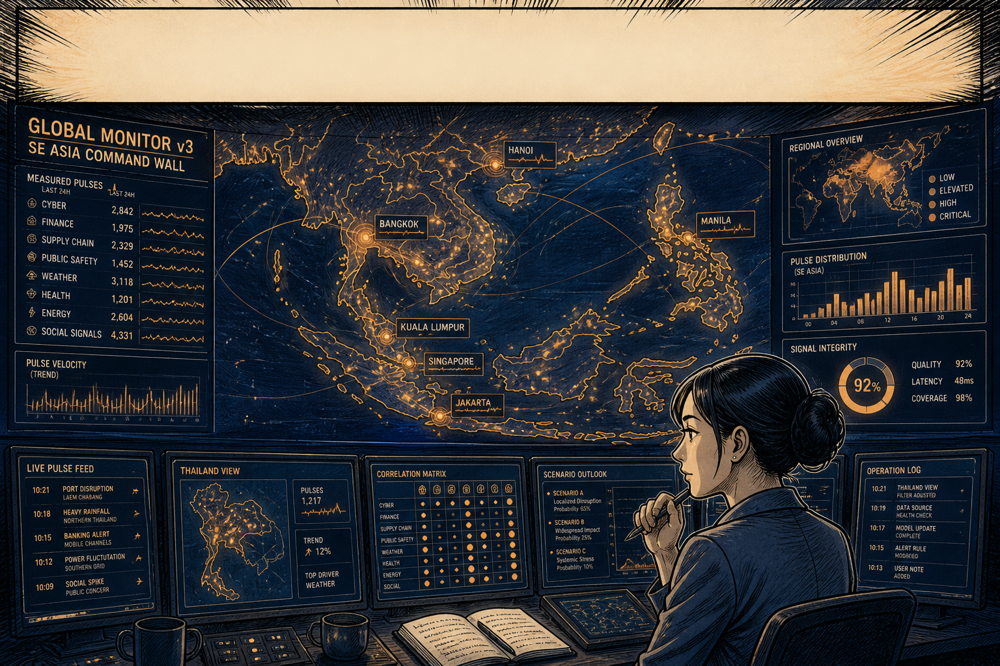
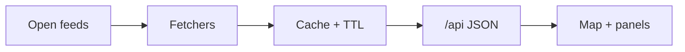

# Global Monitor v3

[](LICENSE)

**Not an official government product.** This is a civic OSINT research dashboard. Funding and execution credits are attribution, not a ministry endorsement. See [Ethical use](#3-ethical-use) and [License](#6-license).



**Illustration only.** Scores and figures drawn in this artwork — Cyber 2,842, Finance 1,975, Supply Chain 2,329, Public Safety 1,452, Weather 3,118, Health 1,201, Energy 2,604, Social Signals 4,331, Signal Integrity 92%, Quality 92%, Latency 48 ms, Coverage 98%, Scenario A 65% — are **not live telemetry**. They belong to the picture, not to the dashboard.

Live flagship: [globalmonitor.nonarkara.org](https://globalmonitor.nonarkara.org/) · same app on [globalmonitor.pages.dev](https://globalmonitor.pages.dev/) · static backup: [nonarkara.github.io/globalmonitor](https://nonarkara.github.io/globalmonitor/)

This repository is **`Nonarkara/globalmonitor-v3`**. It is not [`Nonarkara/globalmonitor`](https://github.com/Nonarkara/globalmonitor). See [What this is](#1-what-this-is).

### Clone and run (no keys required)

```bash
git clone https://github.com/Nonarkara/globalmonitor-v3.git
cd globalmonitor-v3
npm install
npm run dev:stack
```

Requires **Node 20**. That script starts Vite at `http://127.0.0.1:5180` and the cache API at `http://127.0.0.1:4000` (`/api` is proxied). Leave [`.env.example`](.env.example) uncopied unless you have your own provider keys — the UI still renders public fallbacks and committed snapshots. More commands: [How to run / fork](#5-how-to-run--fork). Contribute: [CONTRIBUTING.md](CONTRIBUTING.md). Report a vulnerability: [SECURITY.md](SECURITY.md).

---

## 1. What this is

Global Monitor v3 is **GlobeWatch** — the dense, Rams-style flagship of a small civic OSINT suite. It is a React + Vite + MapLibre instrument panel with a thin cache API, built so a planner can read conflict, climate, mobility, markets, and policy as one operating picture instead of a dozen browser tabs.

It is created by Dr Non Arkaraprasertkul (architect, anthropologist, smart-city practitioner at Thailand’s depa) with Associate Professor Dr Poon Thiengburanathum (public ranking and urban-performance methodology). Research is funded by **PMUA**, with supporting organisations depa / MDES / Smart City Thailand and execution by Axiom and ReTL. Funding is not a ministry product and is not official government intelligence.

Four theaters share one build: **Middle East**, **Indo-Pacific**, **Thailand**, and **Global**. The initial theater is chosen at runtime from the hostname (`globalmonitor.nonarkara.org` → Middle East; `global.nonarkara.org` → Global). Depth that lives in this tree — live air and sea traffic, flood-risk tooling, an Oracle Monte-Carlo forecast, sanctions, live TV — is the flagship’s job.

### Sibling: `Nonarkara/globalmonitor`

| | This repo (`globalmonitor-v3`) | Sibling (`globalmonitor`) |
| --- | --- | --- |
| Role in the suite | GlobeWatch — deep flagship, Rams instrument panel | Independent digital-economy and geopolitical OSINT map (GitHub’s own description: not a depa product) |
| GitHub homepage | [globalmonitor.pages.dev](https://globalmonitor.pages.dev/) | [nonarkara.github.io/globalmonitor](https://nonarkara.github.io/globalmonitor/) |
| Also live (verified this session) | [globalmonitor.nonarkara.org](https://globalmonitor.nonarkara.org/) | [asia.nonarkara.org](https://asia.nonarkara.org/) — AsiaWatch, the wide Asia build from that tree |
| What to fork for | Per-theater aircraft and ships, Oracle, TV, sanctions, flood ops, four-theater hostname routing | The wider Asia map and that tree’s own method |

If they did the same thing, there would be one system twice. Fork the repo that matches the job. The two GitHub repositories are not mirrors of each other; this v3 tree is the flagship instrument panel.

---

## 2. Philosophy / invitation

The civic gift is the **method**, not a brand. Fork it. Keep the sources visible. Prefer a system a non-engineer can still open.

- **Less, but better.** The live UI follows a Dieter Rams instrument-panel system — warm paper, one Braun-green signal colour, hairline cells, no glass, no second hue. Design notes: [`docs/RAMS-STYLE.md`](docs/RAMS-STYLE.md). Every panel earns its place or it is removed.
- **Fork the method.** Each theatre is a camera plus a set of open feeds, not a secret model. If you need a quieter map, Thai-first copy, or a different country, start from this repo rather than from a screenshot.
- **Civic transparency.** A closed intelligence product asks for trust. An open one earns it or gets corrected. Every live number should carry a source and an age; a figure without either is treated here as a defect.
- **Human-scale systems.** Google Sheets when Sheets will do. Public NASA tiles when a paid satellite contract would only prove cleverness. Fix the plain way, so someone who is not the author can still understand it.
- **Bilingual where it matters.** This README is English. เชิญให้แยกสาขาวิธีการ — เปิดแหล่งข้อมูลให้ตรวจได้ และบอกให้ชัดเมื่อตัวเลขเป็นการวัดจริงหรือเป็นแบบจำลอง

Dr Non’s origin note ships in the in-app Papers tab (`src/data/originEssay.js`): the work exists so a person deciding whether it is safe to send someone somewhere has observations to look at, not only a headline.

---

## 3. Ethical use

Use this for lawful research, education, and situational awareness. Do not present the output as official intelligence, military guidance, or a government product.

- **Measured vs modelled.** FIRMS thermal detections, AIS ship reports, ADS-B aircraft, USGS quakes, and NASA GIBS tiles are *observations* (with their own biases and gaps). The Oracle forecast (Monte-Carlo rollouts from live signals), escalation composites, TimesFM event-count files, AlphaEarth year-to-year change, and bundled JSON briefings under `src/data/` are *modelled or compiled*. Label them that way when you republish.
- **Funding is not an endorsement.** The About modal records PMUA / depa / MDES support and Axiom + ReTL execution. That is attribution of research funding. It is not a classified product, not ministry policy, and not a licence to speak in a government’s name. Do not add a government endorsement in a fork unless that endorsement actually exists and is recorded in this repository.
- **Attribute upstream data.** Conflict events, satellite detections, market prices, flights, and vessels come from third parties listed in [`src/data/dataSources.json`](src/data/dataSources.json). Each keeps its own licence, latency, and limits. Axiom Overwatch AIS is documented in-repo as [CC-BY 4.0](https://axiomoverwatch.io). Open **Data Provenance** from the live map (Tools → source health), or read [`docs/HOW-IT-WORKS.md`](docs/HOW-IT-WORKS.md).
- **Do not operationalise a cache.** Feeds fail silently; stale values are served on purpose and labelled; absence of signal is not absence of danger. Cross-check primary sources before any decision that requires verified official information.

---

## 4. How the system works

Open data is fetched, cached with an expiry, and drawn on a map. Provenance travels with the payload.



Open feeds in this tree include ACLED, NASA FIRMS/GIBS, AIS, ADS-B, USGS, RSS, ReliefWeb/UNHCR, EIA, and the others listed in [`src/data/dataSources.json`](src/data/dataSources.json). Fetchers live in `server/lib` (local Node) and `functions/_lib` (Cloudflare Pages). Cache replies are live or stale, never silent; `/api` payloads carry `X-Tech-*` provenance headers into React + MapLibre.

Same-origin `/api/*` in production (Cloudflare Pages Functions, project **`globalmonitor`**). Locally, Vite on port **5180** proxies `/api` to a Node cache on **4000**. Optional keys in [`.env.example`](.env.example) enrich feeds; the UI still renders public fallbacks and snapshot files when keys are missing. Only endpoints that exist in `server/` and `functions/` are documented.

Longer architecture, measured-vs-modelled table, optional credentials, and Cloudflare caveats: [`docs/HOW-IT-WORKS.md`](docs/HOW-IT-WORKS.md).

---

## 5. How to run / fork

Requires **Node 20** (CI) and npm. No private endpoints are required.

```bash
git clone https://github.com/Nonarkara/globalmonitor-v3.git
cd globalmonitor-v3
npm install
npm run dev:stack
```

That script starts:

- frontend — Vite, `http://127.0.0.1:5180`
- API cache — Node, `http://127.0.0.1:4000` (`/api` proxied)

Copy [`.env.example`](.env.example) to `.env.local` only if you have your **own** keys from those public providers (Copernicus, OpenSky, ACLED, FIRMS, and so on). Do not invent or scrape keys. Leave the file empty and the dashboard still runs: public NASA GIBS tiles, snapshot GeoJSON under `public/data/`, and browser-side fallbacks are in the tree.

Commands that actually exist in `package.json`:

| Command | What it does |
| --- | --- |
| `npm run dev:stack` | Local frontend + API together |
| `npm run dev` / `npm run api` | Frontend or API alone |
| `npm run lint` | ESLint |
| `npm test` | Data-honesty and news-ingest tests (`tests/*.test.mjs`) |
| `npm run build` | Production static build to `dist/` |
| `npm run preview` | Serve the production build |
| `npm run refresh:flights` | Rewrite the ADS-B safety snapshot used when live providers do not answer |
| `npm run deploy:pages` | Refresh snapshot, build, deploy to Cloudflare Pages project `globalmonitor` |

Cloudflare Pages is the documented host. GitHub Actions (`.github/workflows/cloudflare-pages.yml`) and `npm run deploy:pages` both target project **`globalmonitor`**. A fork should point wrangler at **your** Pages project. Bind optional secrets in the host dashboard, never as `VITE_*` variables. Pull-request expectations: [CONTRIBUTING.md](CONTRIBUTING.md).

Sister public maps (separate repos, not this tree): [AsiaWatch](https://asia.nonarkara.org/), [World Console](https://global.nonarkara.org/), [MEM by NON](https://mem.nonarkara.org/), [War Monitor](https://middleeast-monitor.pages.dev/).

---

## 6. License

[](LICENSE)

This software is released under the [MIT License](LICENSE). Copyright © 2026 **Non Arkaraprasertkul / Axiom X Co., Ltd.**

The method and visual identity are the work of Dr Non Arkaraprasertkul and Associate Professor Dr Poon Thiengburanathum. Keep the copyright and permission notice when you copy or fork. Contact: [non.ar@depa.or.th](mailto:non.ar@depa.or.th).

This dashboard is **not an official government product** and is **not official intelligence**. PMUA / depa / MDES funding and Axiom + ReTL execution are research attribution. Do not present a fork as ministry policy.

Third-party datasets remain under their upstream licences. Attribute them when you republish.

Contribute: [CONTRIBUTING.md](CONTRIBUTING.md). Security reports: [SECURITY.md](SECURITY.md).
